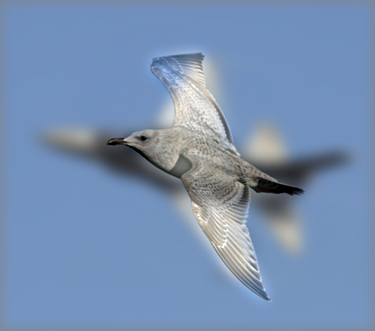
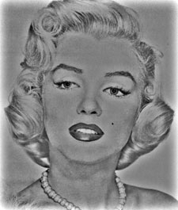
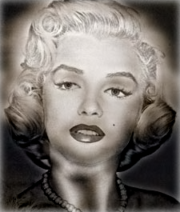

# 陳麒皓 <span style="color:red">(student ID : 106061516)</span>

# Project 1 / Image Filtering and Hybrid Images

## Overview
The goal of this assignment is to write an image filtering function and use it to create hybrid images using a simplified version of the SIGGRAPH 2006 paper by Oliva, Torralba, and Schyns.  
Hybrid images are static images that change in interpretation as a function of the viewing distance. The basic idea is that high frequency tends to dominate perception when it is available, but, at a distance, only the low frequency (smooth) part of the signal can be seen. By blending the high frequency portion of one image with the low-frequency portion of another, you get a hybrid image that leads to different interpretations at different distances.

## Implementation
1. To do 2D convolution :  (Using my_imfilter.py)  
	* A-1. Calculate the number of padding pixels   
	* A-2. Use np.lib.pad function to generate the same imaging with padding 0  
	```
	  pad_x = (imfilter.shape[0] - 1) / 2
	  pad_y = (imfilter.shape[1] - 1) / 2
	  for ch in range(image.shape[2]):
              image_pad = np.lib.pad(image[:, :, ch], ((pad_x, pad_x), (pad_y, pad_y)), 'constant', constant_values = (0, 0))
	```
	* B. Use three for loops to do 2D convolution for color images. This place uses the numpy function&nbsp;--&nbsp;np.multiply and np.sum so that the image and filter can do convolution and sum together.  
	```
	  for ch in range(image.shape[2]):
	      for i in range(output.shape[0]):
                  for j in range(output.shape[1]):
                      output[i, j, ch] = np.sum(np.multiply(image_pad[i:i+imfilter.shape[0], j:j+imfilter.shape[1]], imfilter))
	```
	
2. Create Hybrid Images :  (Using proj1.py)  
	* A. Get low-frequency dominated picture :  
	&emsp;&nbsp;Use Gaussian filter to filter the high frequency components and get low-frequency dominated picture.
	```
   	  low_frequencies = my_imfilter(image1, gaussian_filter)
	```    
	* B. Get high-frequency dominated picture :  
	&emsp;&nbsp;First, use Gaussian filter to filter the high frequency components and get low-frequency dominated picture. After that, the origin picture subtract the low-frequency dominated picture to get the high-frequency dominated picture. This way is easier than using high pass filter.

	```
   	  high_frequencies = image2 - my_imfilter(image2, gaussian_filter)
	```
	* C. Merge the above two pictures to get hybrid image:
	```
	  hybrid_image = low_frequencies + high_frequencies
	```

## Installation
* Other required packages  
	Install numpy, matplotlib (pip install pillow if u need)
	
* How to run the code&emsp;---&emsp;python proj1.py

### Results Overview
(&emsp;Low-freq.&emsp;/&emsp;High-freq.&emsp;/&emsp;Hybrid image&emsp;/&emsp;Hybrid scale image&emsp;)

&emsp; __Upper:__ dog(low-freq.); cat(high-freq.) &emsp;&emsp; __Lower:__ cat(low-freq.); dog(high-freq.)
<table border=1>
<tr>
<td>


</td>
</tr>
<tr>
<td>


</td>
</tr>
</table>  
  
&emsp; __Upper:__ bicycle(low-freq.); motorcycle(high-freq.) &emsp;&emsp; __Lower:__ motorcycle(low-freq.); bicycle(high-freq.)
<table border=2>
<tr>
<td>


</td>
</tr>
<tr>
<td>


</td>
</tr>
</table>

&emsp; __Upper:__ bird(low-freq.); plane(high-freq.) &emsp;&emsp; __Lower:__ plane(low-freq.); bird(high-freq.)
<table border=3>
<tr>
<td>


</td>
</tr>
<tr>
<td>




</td>
</tr>
</table>

&emsp; __Upper:__ fish(low-freq.); submarine(high-freq.) &emsp;&emsp; __Lower:__ submarine(low-freq.); fish(high-freq.)
<table border=4>
<tr>
<td>


</td>
</tr>
<tr>
<td>


</td>
</tr>
</table>

&emsp; __Upper:__ marilyn(low-freq.); einstein(high-freq.) &emsp;&emsp; __Lower:__ einstein(low-freq.); marilyn(high-freq.)
<table border=5>
<tr>
<td>


</td>
</tr>
<tr>
<td>




</td>
</tr>
</table>

### Discussion for result overview
The above results just implement with cutoff frequency is equal to __7__. From these results, we can know that we cannot use just one cutoff frequency to do all hybrid images. Therefore, we should change the cutoff frequency by ourself to get the better performance.


## Comparison 1 --&nbsp;bright&nbsp;/&nbsp;dark   
The original pictures are:  
&emsp;&emsp;  
The parameter setting like&emsp;:&emsp;(&nbsp;low-frequency&nbsp;picture&nbsp;/&nbsp;high-frequency&nbsp;picture&nbsp;/cutoff&nbsp;frequency&nbsp;)   
&emsp;&emsp;&emsp;First. (&nbsp;cat&nbsp;/&nbsp;dog&nbsp;/&nbsp;3&nbsp;)&nbsp;&emsp;&emsp;Second. (&nbsp;cat&nbsp;/&nbsp;dog&nbsp;/&nbsp;5&nbsp;)&nbsp;&emsp;&emsp;&emsp;Third. (&nbsp;dog&nbsp;/&nbsp;cat&nbsp;/&nbsp;3&nbsp;)&nbsp;&emsp;&emsp;&emsp;Fourth. (&nbsp;dog&nbsp;/&nbsp;cat&nbsp;/&nbsp;5&nbsp;)
<table border=1>
<tr>
<td>
  
  


</td>
</tr>
</table>  

### Discussion for comparison 1  
For my opinion, if the bright picture with low frequency domindated and dark picture with high frequency dominated merge to get the hybrid image, I cannot identify by eyes clearly. Because the hybrid image shows with bright color and let me focus on the bright color more, this match for me is worse one. However, if we use dark picture with low frequency dominated and bright picture with high frequency dominated, the experience I got is more obvious.

## Comparison 2 --&nbsp;Different&nbsp;cutoff&nbsp;frequency  
The original pictures are:  
&emsp;&emsp;  
The cutoff frequencies below are 1,&nbsp;3,&nbsp;5,&nbsp;7,&nbsp;9.  
(Einstein picture uses low frequency, and marilyn picture uses high frequency.)

<table border=2>
<tr>
<td>
  
  



</td>
</tr>
</table> 


### Discussion for comparison 2  
From these results, we can know that difftent matching of the pictures  will use different cutoff frequency. If we want to get the better performance, we should change the cutoff frequency by ourself and not just use one to try every pictures matching.  
By comparison 1, we know that if two pictures tints are very different, we might focus on the brighter one. But the two pictures of this matching almost the same tint, hence, the performance is good.
